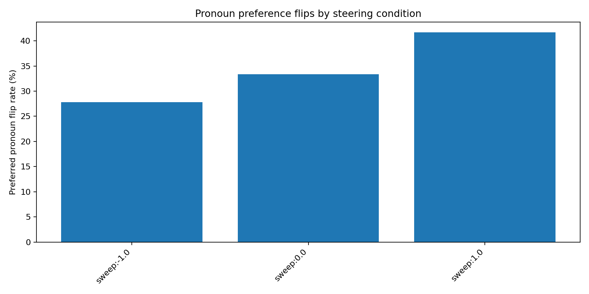

# Occupation Bias Causal Steering Report

## Objective

This report evaluates whether GP-derived causal steering directions transfer to occupation prompts and modulate stereotyped pronoun preference in a controlled way.

## Experimental Artifacts

- **Results JSON**: `../bias_causal_steering`
- **Prompt source**: `occupation_bias_prompts.json`
- **Mode**: `sweep`
- **Direction group**: `all_gender`
- **Number of prompts**: `36`

## High-level findings

- **Most feminizing condition**: `sweep:1.0` with mean `delta_bias = -0.935`
- **Most masculinizing condition**: `sweep:-1.0` with mean `delta_bias = -0.321`

## Bias score curves

## Delta bias curves

## Flip rates

## Condition summary

| Condition | Mean baseline bias | Mean steered bias | Mean delta bias | Flip rate |
| --- | ---: | ---: | ---: | ---: |
| sweep:-1.0 | 0.532 | 0.210 | -0.321 | 27.78 |
| sweep:0.0 | 0.532 | -0.097 | -0.629 | 33.33 |
| sweep:1.0 | 0.532 | -0.404 | -0.935 | 41.67 |

## Interpretation

- **Negative delta bias** means steering moved the model toward `she`.
- **Positive delta bias** means steering moved the model toward `he`.
- **Flip rate** measures how often the preferred binary pronoun changed between baseline and steered evaluations.

## Next steps

- **Compare direction groups** by running the evaluator for `masculine`, `feminine`, and `all_gender` separately.
- **Extend prompt coverage** with more occupations and more template variants.
- **Add prompt-level case studies** for the strongest successful and failed mitigation examples.
