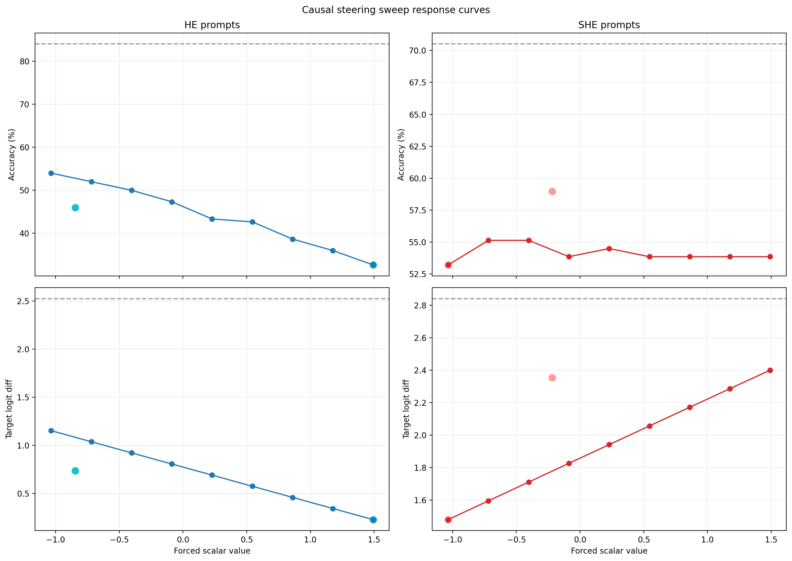
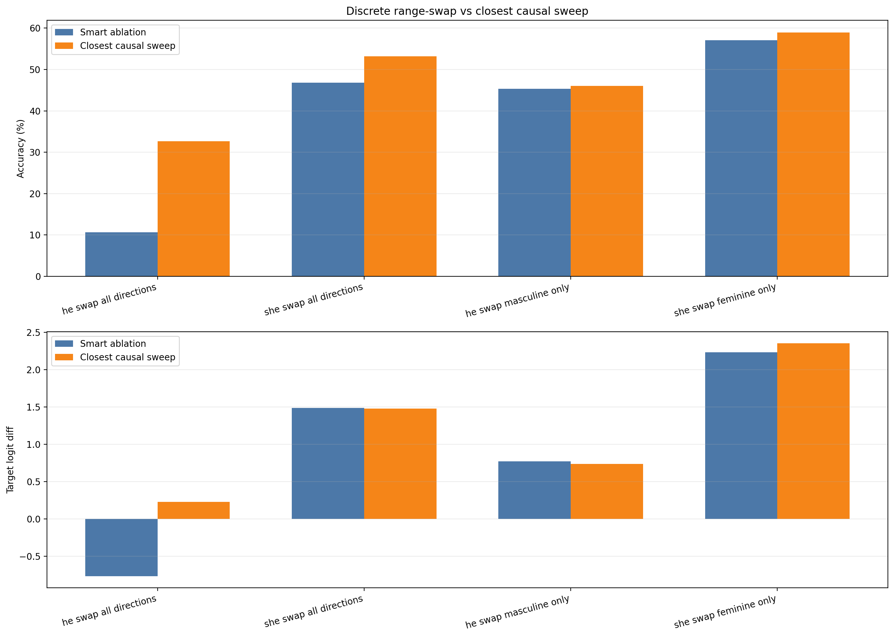
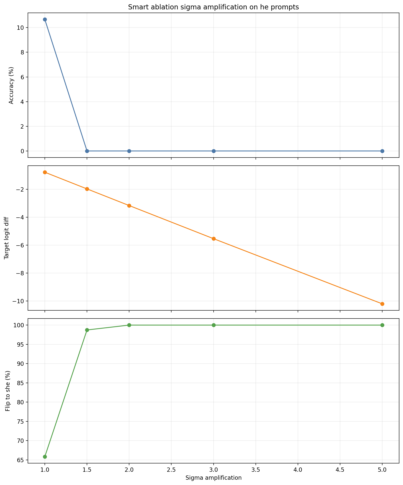
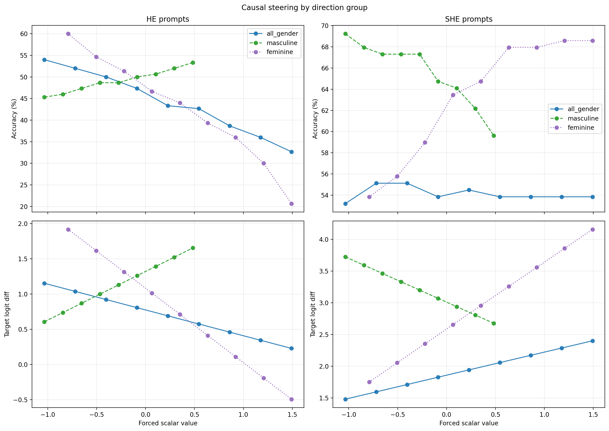
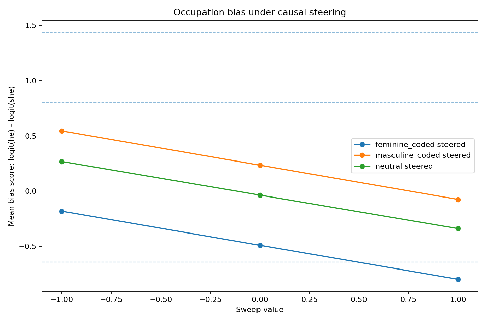
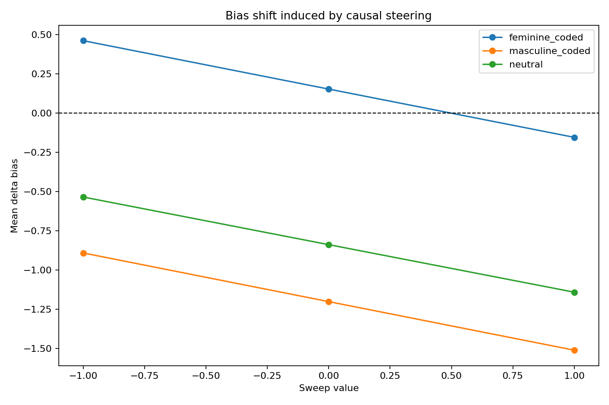
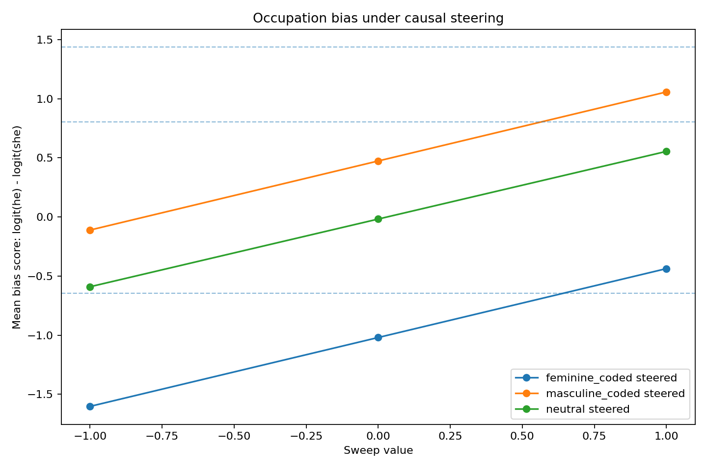
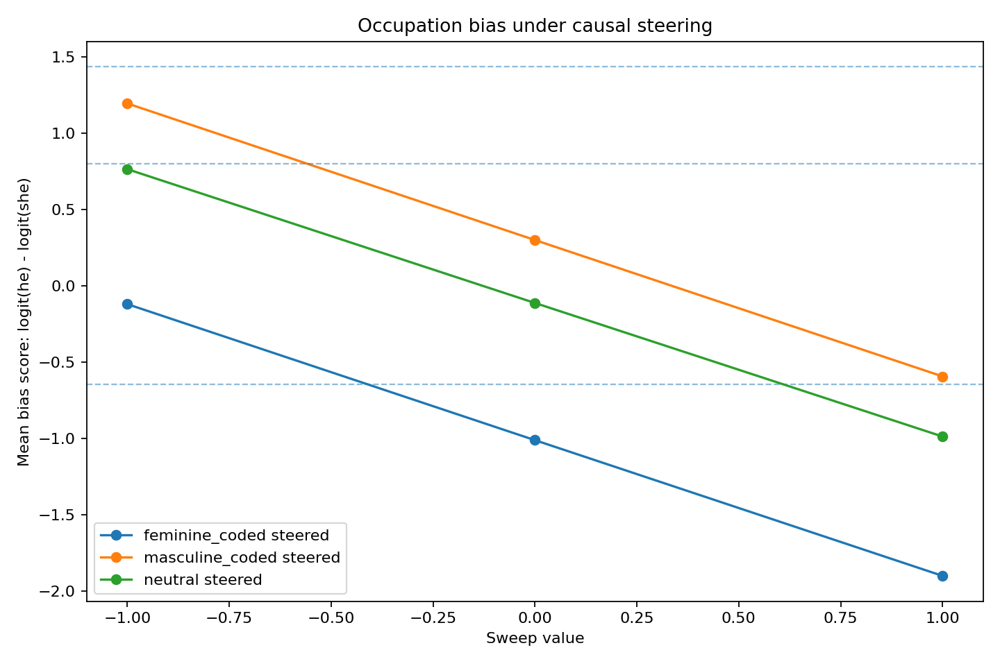

# Presentation Source: Full Story of the Causal Steering and Bias-Mitigation Exploration

## Suggested use

This file is intentionally written as a presentation source document rather than a final slide deck.

You can convert it into slides by treating each major section or slide cluster as one or more slides, keeping the bolded takeaways as slide titles or speaker cues, and reusing the embedded figures directly.

## Title ideas

- **From Causal Steering to Bias Mitigation: A Mechanistic Exploration in GPT-2 Small**
- **Discovering and Steering Gender-Pronoun Control Directions in GPT-2 Small**
- **Can Internal Causal Directions Become a Bias-Reduction Mechanism?**
- **From GP Directions to Occupation Bias Control**

## One-paragraph summary

This document tells the full story of the work carried out across the latest phase of the project. We began with a focused mechanistic question on the GP task: can a small set of discovered OV singular directions in GPT-2 Small be intervened on in a causal way to change the model's pronoun behavior? We then compared continuous causal steering against smart ablation and found that the selected directions exert real causal control, especially on `he` prompts. As the empirical results became clearer, the project evolved into a broader and more interesting question: if these directions are genuinely causal, can they be used to modulate stereotype-like behavior in natural prompts such as `doctor -> he` and `nurse -> she`? That transition led to a new experiment methodology, a new prompt evaluation pipeline, occupation-bias transfer experiments, and the first evidence that GP-derived directions can indeed change gendered pronoun preference outside the original dataset. The results are promising, but they are asymmetric and incomplete, which makes the next steps scientifically meaningful rather than merely incremental.

**Presentation takeaway:** This is a story about how a mechanistic control experiment on pronouns grew into a candidate bias-modulation framework.

## Slide cluster A: Motivation and starting point

## 1. Project background

The work started in the context of mechanistic interpretability and circuit discovery in GPT-2 Small.

The repository already supported:

- singular-value decomposition of internal operators such as OV
- direction-level masking and circuit analysis
- GP-task interventions based on empirically measured gender-conditioned activation ranges
- output-side measurement using pronoun logits and prediction flips

This meant the project was already close to supporting a more explicit causal steering study. Instead of only describing which directions correlate with gender-pronoun behavior, we could try to directly intervene on them and observe whether they actually control the model's outputs.

At the beginning, the primary scope was narrow and well-defined:

- task: GP
- model: GPT-2 Small
- direction family: selected OV singular directions
- intervention site: final residual stream before `ln_final`
- objective: test causal control over ` he` and ` she` behavior

## 2. Where we started conceptually

The original question was not yet about occupation bias or practical bias mitigation.

The starting point was more mechanistic:

> If we identify a small number of gender-sensitive OV singular directions, can we intervene on their scalar activations and force predictable changes in the model's `he` vs `she` logits?

The key idea was that these directions might behave like controllable internal receptors.

Operationally, for a given direction, the relevant quantity is the scalar activation:

`alpha_i = V' · u_i`

where:

- `u_i` is the left singular vector
- `V'` is the augmented attention context
- `sigma_i` and `v_i` map changes in that scalar into a residual-stream write

The intervention rule then modifies the scalar and converts it into a residual update:

`delta_resid = (alpha_i_new - alpha_i_old) * sigma_i * v_i`

The working hypothesis was:

> A small set of OV singular directions acts as controllable gender-sensitive logit receptors whose scalar activations causally influence pronoun behavior.

**Presentation takeaway:** The original goal was mechanistic, not applied: find out whether these discovered directions actually control outputs.

## 3. The original experiment plan

The first experimental plan was centered on GP and involved four increasingly strong forms of intervention.

### 3.1 Mean swap

Replace a direction's current scalar with the opposite-gender empirical mean.

This was the simplest controlled intervention and closely matched the existing range-swap logic already present in the repository.

### 3.2 Additive steering

Add a fixed offset to the current scalar activation.

This was intended as a more natural causal steering mechanism than discrete swapping.

### 3.3 Sigma-scaled steering

Steer by multiples of the empirical standard deviation associated with a gender-conditioned distribution.

This provided a normalized scale for intervention strength.

### 3.4 Direct target-value sweep

Clamp selected directions to scalar target values across a range.

This produced dose-response curves and was especially important for demonstrating monotonicity or controllability.

## 4. The first implementation decisions

Several implementation decisions were made early because they determined how interpretable and feasible the causal steering experiments would be.

### 4.1 Intervention site

The intervention was applied at the final residual stream before `ln_final`.

This matched the existing intervention code and kept the method close to the discovered OV directions and their downstream effect on logits.

### 4.2 Direction source

The initial directions came from empirically measured `DIRECTION_RANGES` already present in `experiments/ablation/intervention.py`.

These included:

- masculine-coded directions such as `L9.H7.SV1` and `L11.H8.SV6`
- feminine-coded directions such as `L10.H9.SV0` and `L11.H8.SV9`
- a plural comparison direction

### 4.3 Evaluation metrics

The early evaluation metrics focused on:

- accuracy on GP subsets
- target logit difference
- `they` logit as a specificity or uncertainty signal
- direct prediction flips between `he` and `she`

This metric set was important because it let us distinguish genuine pronoun transfer from generic uncertainty.

**Presentation takeaway:** Before asking whether we can reduce bias, we first need to show real causal control in a clean benchmark.

## Slide cluster B: GP causal steering and ablation results

## 5. The first set of empirical questions

As the steering pipeline came together, the questions became more concrete.

We wanted to know:

- do scalar sweeps produce dose-response behavior?
- are the interventions stronger on some prompt types than others?
- are some direction groups more causal than others?
- how does continuous steering compare to smart ablation?
- can sufficiently strong intervention cross the decision boundary and reverse the model's output?

These questions set up the first major comparison phase.

## 6. Comparing causal steering and smart ablation on GP

The work then expanded into a direct comparison between two intervention families.

### 6.1 Causal steering

This method continuously manipulated scalar activations across a range and measured how the output changed.

Its main strength was interpretability:

- it gives smooth dose-response curves
- it shows monotonicity or non-monotonicity
- it makes controllability visible rather than binary

### 6.2 Smart ablation

This method used discrete opposite-gender range swaps and optional sigma amplification.

Its main strength was force:

- it produces strong endpoint effects
- it can push the model across decision boundaries
- it shows that the internal mechanism is powerful enough to reverse behavior under sufficient intervention

### 6.3 Why this comparison mattered

If both methods pointed in the same general direction, that would be strong evidence that the discovered OV directions were not artifacts of a single intervention style.

Instead, they would look like stable internal control axes that can be manipulated in multiple ways.

## 7. What we found on GP

The GP results were the first major confirmation that the idea was working.

### 7.1 Baseline GP behavior

On the GP task, baseline performance showed:

- **HE prompts**: accuracy `84.00%`, target logit diff `2.525`, they logit `11.691`
- **SHE prompts**: accuracy `70.51%`, target logit diff `2.840`, they logit `11.886`

### 7.2 Causal steering findings

The continuous steering sweep showed clear dose-response behavior.

On `he` prompts:

- accuracy dropped from `84.00%` to `32.67%`
- target logit difference dropped from `2.525` to `0.228`

On `she` prompts:

- the best sweep only reduced accuracy to `53.21%`
- target logit difference remained positive at `1.480`

*Figure cue: Continuous causal steering yields a clear dose-response curve, with substantially stronger control on `he` prompts than on `she` prompts.*

This was already a strong result because it showed that the intervention changes the model's output in a structured way. But it also revealed an asymmetry: the intervention was much stronger on `he` prompts than on `she` prompts.

### 7.3 Smart ablation findings

Smart ablation was even more dramatic.

For `he` prompts:

- accuracy dropped to `10.67%`
- target logit difference became negative: `-0.768`
- there were `52` flips to `she`

For `she` prompts:

- accuracy dropped to `46.79%`
- target logit difference remained positive: `1.487`
- there were only `4` flips to `he`

*Figure cue: Smart ablation produces stronger endpoint effects than smooth causal steering, especially on `he` prompts.*

This confirmed the asymmetry seen in the causal sweep.

### 7.4 Sigma amplification findings

Sigma amplification revealed that the mechanism could fully cross the decision boundary in at least one direction.

At `sigma x 2.0`:

- `he` accuracy became `0.00%`
- flip-to-`she` reached `100.00%`

*Figure cue: Sigma amplification shows that the intervention can fully cross the decision boundary in the stronger direction.*

This was one of the strongest pieces of evidence in the whole project because it showed that the intervention is not merely nudging the model. It can completely override the output in the stronger direction.

### 7.5 Direction-group findings on GP

The selective comparisons also mattered.

The later results showed dedicated causal comparisons for direction groups:

- **Closest causal match for masculine-only comparison**: accuracy `46.00%`, target logit diff `0.738`
- **Closest causal match for feminine-only comparison**: accuracy `58.97%`, target logit diff `2.354`

*Figure cue: Different direction groups behave differently, which suggests the mechanism is structured rather than a single uniform knob.*

These group-specific results reinforced the idea that not all direction subsets contribute in the same way.

## 8. The first major interpretation

At this stage, the main conclusion was:

> the selected OV directions have real downstream causal control over gender-pronoun behavior in GPT-2 Small

But another conclusion emerged at the same time:

> the control is asymmetric, with much stronger intervention effects on `he` prompts than on `she` prompts

That asymmetry became a central theme because it suggested either:

- the current directions capture masculine evidence more completely than feminine evidence, or
- the current steering method is too coarse to recover symmetric control

**Presentation takeaway:** The GP phase established causality, but it also revealed that the current control is asymmetric.

## Slide cluster C: The turning point toward bias mitigation

## 9. The moment the project changed direction

This was the conceptual turning point.

Once the GP results showed strong causal influence, especially strong enough to reverse `he` behavior under ablation and amplification, a new question naturally emerged:

> If these directions truly control gendered behavior, could they also be used to modulate bias-like behavior in natural prompts?

That is where the idea of bias reduction or bias modulation came in.

This was not the original experiment goal. It emerged from the strength of the GP findings.

The intuition was straightforward:

- if the model has internal gender-sensitive directions
- and if those directions causally affect pronoun choice
- then those same directions might also be contributing to stereotyped completions such as `doctor -> he` or `nurse -> she`

That possibility turned the project from a task-specific causal steering study into something larger:

> a possible mechanistic bias-control experiment

## 10. How the bias-mitigation idea formed

The bias-mitigation idea did not come from nowhere. It was a direct consequence of the experimental results.

There was a sequence of thought:

1. We found candidate GP directions.
2. We intervened on them and saw large changes in pronoun behavior.
3. We observed that these directions were not merely diagnostic but causally active.
4. That suggested they might represent a reusable internal gender feature.
5. If so, then they might matter outside the original GP dataset.
6. Occupation prompts are a natural and socially meaningful testbed for that transfer.

So the bias-mitigation framing was not a separate idea pasted onto the project. It emerged organically from the mechanistic findings.

**Presentation takeaway:** The bias question emerged because the GP directions looked genuinely causal and potentially reusable beyond the original dataset.

## Slide cluster D: New occupation-bias methodology and pipeline

## 11. The new objective after that realization

The objective expanded from:

> Can we causally steer pronoun behavior on GP?

to:

> Can GP-derived internal directions become a controllable mechanism for mitigating or modulating gender bias in natural occupation prompts?

This was scientifically stronger for several reasons.

- it tested transfer beyond the original task
- it tested whether the directions correspond to a broader internal feature rather than a GP-specific trick
- it connected mechanistic interpretability to a more applied and recognizable phenomenon: stereotype-like gender bias in language generation

## 12. The new methodology for occupation bias

Once this new objective became clear, a dedicated methodology document was written to formalize the experiment.

The central requirement of the new methodology was that it had to measure both:

- current bias before intervention
- bias after causal steering

Without both measurements, we would not be able to claim bias modulation.

### 12.1 Baseline bias measurement

For each occupation prompt, the model's baseline values had to be recorded:

- `logit(he)`
- `logit(she)`
- `logit(they)`

The primary bias score was defined as:

- `bias_score = logit(he) - logit(she)`

Interpretation:

- positive means the model currently leans toward `he`
- negative means the model currently leans toward `she`
- near zero means weak binary preference

### 12.2 Post-steering bias measurement

After intervention, the same metrics were recomputed and compared against baseline.

The central shift metric was:

- `delta_bias = bias_score_after - bias_score_before`

Interpretation:

- negative `delta_bias` means the intervention pushed toward `she`
- positive `delta_bias` means the intervention pushed toward `he`

### 12.3 Additional controls

To avoid confusing bias modulation with generic model degradation, the methodology also tracked:

- `they` logit
- probabilities of `he`, `she`, and `they`
- top prediction changes
- preferred binary pronoun flips
- per-direction scalar values before and after intervention

**Presentation takeaway:** The occupation experiment was designed to measure both baseline bias and post-steering bias, not just one or the other.

## 13. The occupation prompt set

A reusable prompt set was created with `36` prompts spread across three categories.

### 13.1 Masculine-coded occupations

- doctor
- engineer
- scientist
- lawyer

### 13.2 Feminine-coded occupations

- nurse
- receptionist
- babysitter
- housekeeper

### 13.3 Neutral occupations

- teacher
- writer
- manager
- student

Each occupation had multiple prompt templates such as:

- `The doctor said that`
- `The nurse explained that`
- `The manager told the team that`
- `The student realized that`

This was designed to reduce the chance of cherry-picking a single prompt form.

## 14. The new engineering pipeline

To support the occupation-bias experiment, a new evaluation and reporting pipeline was built.

### 14.1 Evaluation script

A dedicated script was created to evaluate arbitrary prompts under baseline and steering conditions.

It logs:

- per-prompt baseline metrics
- per-prompt steered metrics
- delta bias and logit deltas
- pronoun flips
- per-direction scalar changes
- aggregate summaries by condition and by category

### 14.2 Flat CSV export

The evaluator was extended to produce a flat CSV view in addition to structured JSON.

This makes the results easier to inspect, sort, or plot externally.

### 14.3 Reporting pipeline

A separate plotting and report-generation script was built to produce:

- bias score curves
- delta bias curves
- pronoun flip rates
- Markdown reports summarizing each direction group

### 14.4 Group-specific runs

The occupation-bias evaluation was run for:

- `all_gender`
- `masculine`
- `feminine`

This turned out to be an important design choice because the direction groups behaved differently.

**Presentation takeaway:** We built a new reusable prompt-evaluation pipeline so the mechanistic intervention could be tested on natural prompts, not only GP.

## Slide cluster E: Occupation-bias transfer results

## 15. Occupation-bias results

This was the second major empirical phase.

### 15.1 Baseline occupation bias

Across the prompt set, the mean baseline bias score was:

- `0.532`

So before intervention, the prompt set leaned toward `he` overall.

### 15.2 All-gender direction group

Condition summary:

- `sweep:-1.0` -> steered bias `0.210`, delta bias `-0.321`, flip rate `27.78%`
- `sweep:0.0` -> steered bias `-0.097`, delta bias `-0.629`, flip rate `33.33%`
- `sweep:1.0` -> steered bias `-0.404`, delta bias `-0.935`, flip rate `41.67%`

Interpretation:

- all tested settings move the model toward `she`
- larger tested sweep settings produce larger feminizing shifts
- these shifts are strong enough to flip the model's preferred pronoun on many prompts

*Figure cue: Using all gender directions shifts the average occupation bias steadily toward `she` across the tested sweep values.*

*Figure cue: The delta-bias curve makes the direction and strength of the intervention explicit relative to baseline.*

*Figure cue: Pronoun flip rates show that the intervention is changing actual preferred outputs, not merely shrinking margins.*

### 15.3 Masculine-only direction group

Condition summary:

- `sweep:-1.0` -> steered bias `-0.768`, delta bias `-1.300`, flip rate `44.44%`
- `sweep:0.0` -> steered bias `-0.188`, delta bias `-0.720`, flip rate `25.00%`
- `sweep:1.0` -> steered bias `0.392`, delta bias `-0.140`, flip rate `2.78%`

Interpretation:

- this group is still mostly feminizing over the tested range
- the strongest effect happens at `sweep:-1.0`
- by `sweep:1.0`, the effect becomes much weaker

*Figure cue: The masculine-only direction group still mostly feminizes the output over the tested range, though the effect weakens at higher sweep values.*

### 15.4 Feminine-only direction group

Condition summary:

- `sweep:-1.0` -> steered bias `0.614`, delta bias `0.083`, flip rate `19.44%`
- `sweep:0.0` -> steered bias `-0.273`, delta bias `-0.805`, flip rate `33.33%`
- `sweep:1.0` -> steered bias `-1.159`, delta bias `-1.691`, flip rate `61.11%`

Interpretation:

- this is the only tested direction group that produced a positive mean `delta_bias` at one setting
- `sweep:-1.0` slightly pushes the model toward `he`
- `sweep:1.0` strongly pushes the model toward `she`
- this makes the feminine group the clearest sign so far of potentially bidirectional control on occupation prompts

*Figure cue: The feminine-only direction group shows the clearest evidence of bidirectional behavior, with one setting slightly increasing masculine preference and others strongly feminizing it.*

## 16. Why these occupation results matter

The occupation-bias results matter for at least three reasons.

### 16.1 They show transfer

The directions were found on GP, but they also affect natural occupation prompts.

That is strong evidence that the discovered directions are not merely GP-specific shortcuts.

### 16.2 They support a mechanistic bias-modulation claim

The interventions shift `he` vs `she` preference in predictable ways without changing the prompt itself.

That is exactly what one would want from a candidate internal bias-control mechanism.

### 16.3 They reveal that the internal geometry is not trivial

The different direction groups behave differently.

This suggests that the current discovered directions do not form a perfectly simple one-dimensional bias slider. Instead, different subsets likely encode different parts of the gender-related internal feature.

**Presentation takeaway:** The occupation results show transfer, but they also show that the internal control geometry is richer than a single simple dial.

## Slide cluster F: Claims, caveats, and next steps

## 17. The strongest current claims

At this stage, there are several claims that the data strongly support.

### 17.1 Causal control on GP

The selected OV directions causally affect pronoun outputs on GP.

### 17.2 Strong one-direction reversibility

Under strong intervention, especially with smart ablation and sigma amplification, the model's `he` behavior can be pushed decisively toward `she`.

### 17.3 Transfer to occupation prompts

The same GP-derived directions also change pronoun preference on occupation prompts.

### 17.4 Bias modulation depends on group and steering value

The effect is not uniform. Different direction groups and sweep values produce different movement patterns.

## 18. What the current results do not yet prove

It is equally important to state what remains unresolved.

### 18.1 Not full arbitrary control yet

We cannot yet say:

> we can freely set the model to whichever gendered output we want in every prompt

The current control is real but incomplete.

### 18.2 Not full symmetry yet

The results remain asymmetric.

Control is stronger in some directions than others, and some groups mostly produce feminizing shifts over the tested range.

### 18.3 Not a complete bias solution yet

We have not shown that all occupational gender bias is captured by these directions.

We have shown that these directions contribute to that behavior and can modulate it.

That is strong, but it is not the same as total explanation or total mitigation.

**Presentation takeaway:** The current results support causal bias modulation, but not yet full arbitrary or symmetric control.

## 19. Plain-language explanation for a talk

If you want to explain this to a broad audience, the simplest version is:

> We found a few internal knobs in the model that influence whether it prefers `he` or `she`. We first discovered them on a clean pronoun benchmark. Then we turned those knobs and saw that the model's outputs changed. That meant the knobs were actually causal. After seeing that, we asked whether the same knobs also influence stereotype-like behavior in natural prompts like `The doctor said that`. The answer was yes: turning the same internal knobs changed the model's gender preference there as well. So we now have early evidence that an interpretable internal mechanism can be used not only to study bias, but potentially to control or reduce it.

## 20. How to frame the contribution in a presentation

A strong narrative arc for a presentation would be:

1. We started with mechanistic interpretability on GP.
2. We identified candidate gender-sensitive OV directions.
3. We built causal steering experiments and compared them with smart ablation.
4. We found strong causal control, especially on `he` prompts.
5. That made us realize the same mechanism might matter for bias-like behavior.
6. We designed a new occupation-bias evaluation methodology.
7. We built a new pipeline for prompt-based evaluation and reporting.
8. We found that GP-derived directions transfer to occupation prompts and modulate bias.
9. The effects differ by direction group, which opens the door to richer future work.

**Presentation takeaway:** The cleanest story is: mechanistic discovery -> causal validation on GP -> transfer to occupation bias -> candidate bias-reduction mechanism.

## 21. Suggested presentation structure

### Slide cluster 1: Problem and intuition

- what is causal steering?
- what are OV singular directions?
- why pronoun behavior is a useful test case

### Slide cluster 2: Original GP experiment

- intervention mechanism
- direction groups
- metrics
- causal sweep results
- smart ablation comparison

### Slide cluster 3: The turning point

- realization that these directions might not be GP-specific
- intuition connecting GP directions to occupation bias
- why this is scientifically interesting

### Slide cluster 4: New occupation-bias methodology

- prompt categories
- baseline bias measurement
- post-steering bias measurement
- delta bias definition
- evaluator and report pipeline

### Slide cluster 5: Occupation-bias results

- all_gender results
- masculine-only results
- feminine-only results
- interpretation of group differences

### Slide cluster 6: Conclusions and next steps

- what we now know
- what remains unresolved
- why per-direction calibration and denser sweeps matter

## 22. Recommended next steps for the project

### 22.1 Denser sweeps

The current occupation experiments only tested a small number of sweep values.

A denser sweep would help show whether the response curves are smooth, monotonic, or nonlinear.

### 22.2 Combined group-comparison visualizations

A direct visual comparison across `all_gender`, `masculine`, and `feminine` would make the differences much easier to communicate.

### 22.3 Prompt-level case studies

It would be useful to show specific examples where the model clearly flips from one preference to the other, as well as examples where the intervention fails.

### 22.4 Per-direction calibration

Right now, multiple directions share one scalar target or sweep value.

A more realistic control mechanism may require different directions to receive different calibrated targets.

### 22.5 Better specificity analysis

Further analysis should separate:

- targeted `he <-> she` movement
- increases in `they`
- broader distributional distortion

## 23. Final conclusion

The project started as a mechanistic causal steering study on GP. The early goal was simply to test whether discovered OV singular directions in GPT-2 Small causally controlled pronoun outputs.

That goal was achieved: both causal steering and smart ablation showed that the selected directions have real downstream influence, with especially strong control on `he` prompts.

The more interesting development came next. Once those directions were shown to be causal, it became natural to ask whether they were also implicated in stereotype-like gender bias on natural prompts. That led to a new occupation-bias methodology, new evaluation infrastructure, and the first evidence that the GP-derived directions do in fact transfer outside the original benchmark.

So the story is not only that we found an interpretable mechanism. The story is that the mechanism appears to be reusable, causally active, and relevant to a broader bias-related phenomenon. That makes it a promising candidate for a mechanistic bias-modulation or bias-reduction framework, even though the current control remains asymmetric and incomplete.

**Closing slide takeaway:** We started by asking whether these directions matter. We ended up showing that they matter causally, transfer beyond GP, and may form the basis of a controllable bias-modulation mechanism.

## 24. Useful artifact pointers

- **Main GP comparison report**: `comparison_report/report.md`
- **Combined results summary**: `combined_results_summary.md`
- **Bias methodology doc**: `../../bias-mitigation-with-causal-steering.md`
- **Occupation all-gender report**: `bias_causal_steering/report_all_gender/report.md`
- **Occupation masculine report**: `bias_causal_steering/report_masculine/report.md`
- **Occupation feminine report**: `bias_causal_steering/report_feminine/report.md`
- **Occupation prompt file**: `../../occupation_bias_prompts.json`
